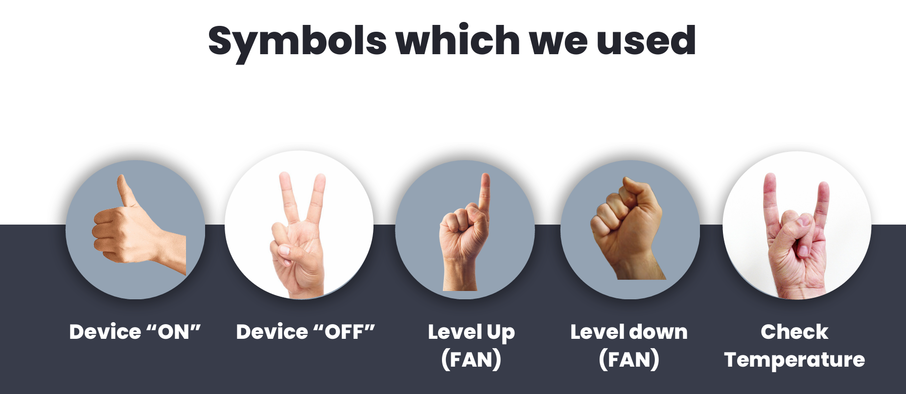

# Hand Gesture-Based Device Control

This project enables hand gesture recognition using a Raspberry Pi, a camera module, and Arduino. It recognizes predefined hand gestures to control devices (e.g., fans, lights, or temperature sensors).

---

## Features
- **Device Control via Gestures:** Control a device's state (ON/OFF) and adjust fan speed or read temperature using simple hand gestures.
- **Real-time Processing:** Uses MediaPipe and OpenCV for gesture recognition.
- **Arduino Integration:** Sends recognized gestures to an Arduino for device control.

---

## Recognized Gestures


| Gesture               | Action                   |
|-----------------------|--------------------------|
| Thumbs Up            | Device ON               |
| Peace/Victory Sign   | Device OFF              |
| Fist                 | Increase Fan Speed      |
| Thumb Down/Fist Down | Decrease Fan Speed      |
| Rock Sign            | Check Temperature       |

---

## Prerequisites

1. **Hardware**
   - Raspberry Pi (with Pi OS)
   - Camera module or USB Webcam
   - Arduino (connected via USB)
   - Additional components (e.g., fans, temperature sensors)

2. **Software Requirements**
   - Python 3
   - Thonny IDE (or any Python IDE on Raspberry Pi)
   - Arduino IDE
   - Required Python libraries:
     - OpenCV
     - MediaPipe
     - Picamera2
     - pyserial

---

## Installation Steps

### 1. Install Required Libraries
```bash
sudo apt update && sudo apt upgrade -y
sudo apt install python3 python3-pip python3-opencv -y
pip3 install mediapipe pyserial
sudo apt install -y python3-picamera2 libcamera-apps
```

### 2. Camera Setup
Ensure the camera is connected and test it:
```bash
libcamera-hello
```

### 3. Arduino Setup
- Upload the Arduino code to interpret the gestures received over serial communication.

### 4. Run the Python Code
1. Open Thonny IDE on Raspberry Pi.
2. Copy and paste the Python code (`gesture_control.py`).
3. Save and run the script.

---

## Usage
- Perform gestures in front of the camera.
- The recognized gesture will send commands to the Arduino to control the device.
- Supported gestures and their actions are listed above.

---

## Future Works
1. Build a **fully automated smart home** based on gesture controls.
2. Enhance usability for **persons with disabilities** to create an accessible environment.
3. Improve gesture recognition accuracy and add more gestures for complex controls.

---

## Contributing
Contributions are welcome! Feel free to fork this repository and submit pull requests for improvements or additional features.

---
